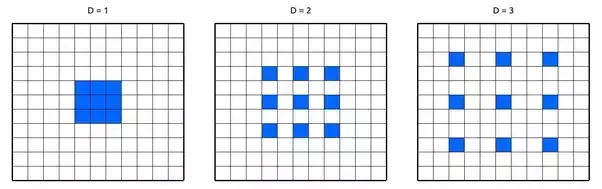
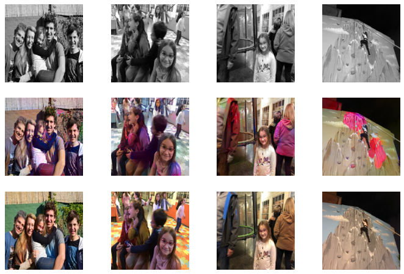
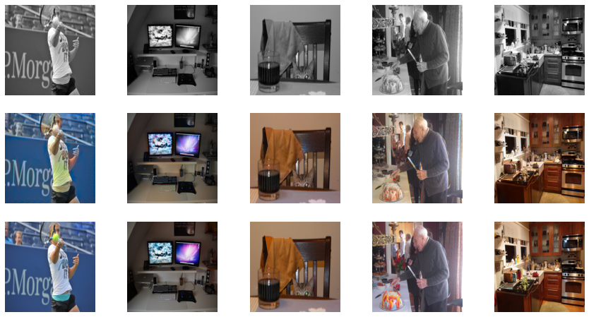
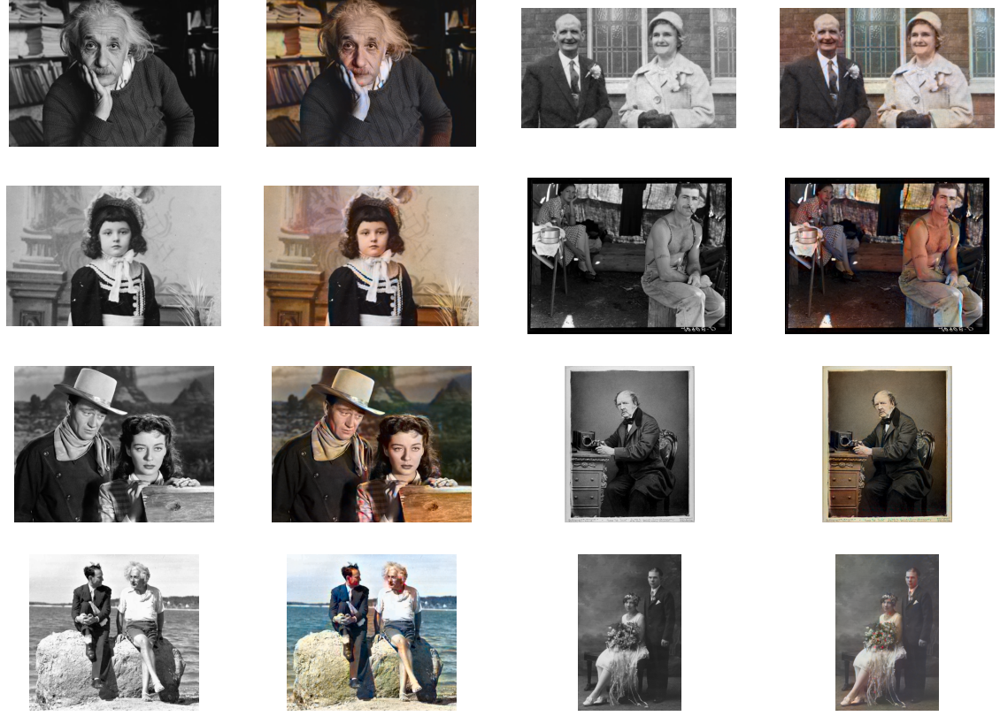
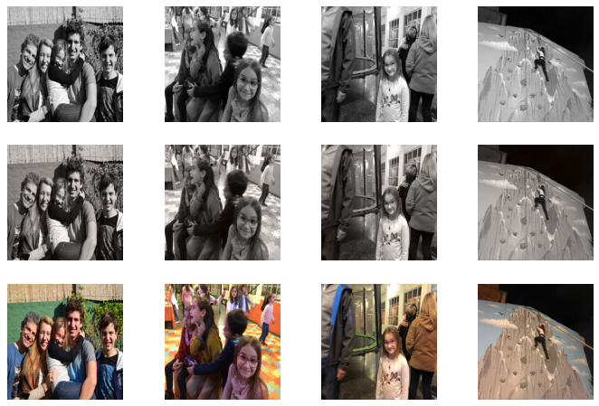

\title{Selective Coloring}
\author{Francisco Noya\\ \texttt{fnoya2@illinois.edu}\\
\And Mesay Taye\\ \texttt{mesayst2@illinois.edu} \\
}
\date{2022-05-06}

In this project we implemented a tool to selectively and automatically colorize the foreground of black and white photographs.  The tool consists of two main algorithms.  First,  a ViT-LSGAN network colorizes the entire photograph.  Second, a segmentation network segments the foreground from the background.  Lastly, colorized foreground is blended with the original background to produce a distinctive image.

# Approach for the Colorization Network

For the colorization task we worked on the __Lab__ colorspace.  In this space, the __L__ channel contains the luminance or intensity information, while the __ab__ channels contain the color information.  Therefore, a neural network can be trained with the __L__ channel of regular color images as input. Its predictions will be "fake" __ab__ channels and its loss will be calculated with the "real" __ab__ channels.

After a short bibliographic review we found that although traditional convolutional neural networks (CNNs) could produce results almost indistinguishable from real color photos [@ZhangIE16], _Generative Adversarial Networks_ or GANs [@goodfellow2014] were the most proper approach for this kind of problem.  This network architecture contains two modules, a Generator and a Discriminator.  Both models are trained in paralell.  The objective of the generator is to produce outputs similar enough to the ground truth that can fool the discriminator.  The discriminator's objective is to properly tell the ground truth from the discriminator output.

Since training this kind of networks requires large datasets and computing time, we decided to use pretrained models that have been used for other tasks such as object classification.  We followed a tutorial inspired by the _pix2pix_ paper [@pix2pix] but instead of training a naïve _UNet_ as the generator, it used a _ResNet18_ network as the generator [@colorizationtutorial].  Similar to _pix2pix_ we used a patch discriminator that splits the image in 26 square patches (depending on the image size) and produces a _real_ or _fake_ prediction for each of them.  

To try different approaches, we decided to use _Transformers_ in place of the discriminator and the generator.  _Transformers_ are a special architecture of DNN that make extensive use of attention mechanisms [@transformers].  Because of their ability to have larger receptive fields compared to convolutional neural networks (CNNs), they can track long-range dependencies within an image. These attention based architectures have proven very effective in image processing tasks and gave rise to Visual Transformers or __ViT__ [@ViT].  We tried different architectures on our own using ViTs either as generators or discriminators and measured a range of metrics for each of them. Finally, we fine tune the loss function to get the best results.
    

## Dataset

For training and validation purposes we used a subset of the COCO dataset of images [@cocodataset] that is provided by the FastAI framework [@fastai]. We downloaded 10.000 images from this dataset and randomly splited them into two sets: a training set with 8.000 images and a validation set with 2.000 images.  Then we resized the images so that they have manageable dimensions that allow feeding into the different network architectures without requiring extremely high computational resources or long times.  Similar to [@pix2pix] data augmentation was achieved by flipping the images horizontally (this is only done for the training set).  We used 16 images on each batch that goes through the network.  Each image was converted to the __Lab__ colorspace and the channels adjusted float values between -1 and 1. 
    
## Model improvement

Our initial model was a variation of the original _pix2pix_ GAN in which the generator was replaced by a pre-trained _ResNet18_ _UNet_.  We then experimented with different visual transfomers as discriminators and generators.  Our final model, named __ViT-LSGAN__, uses a ViT as the generator and least squared errors instead of cross entropy as the loss function of the discriminator.  The results of all the intermediate models that we trained and tested can be found in __"Supplemental Materials"__.

## Loss functions

The loss function of the discriminator for each image is either the binary cross entropy or the least squared errors between the predictions and the ground truth.  The ground truth is either _real_ if the real __ab__ channels were fed into the discriminator, or _fake_ if the generated __ab__ channels were used instead.  The loss function of the generator was the combination of the L1 error and the loss function of the discriminator as if they were _real_ __ab__ channels.  The intuition behind is that the generator "wins" every time it fools the discriminator into assigning _real_ predictions to the generated outputs.

## Model Training, Transfer and Validation

For implementing these models we worked in Python and Jupyter Notebooks making extensive use of PyTorch and NumPy libraries.  All the training was done on a machine equipped with an NVIDIA K80 GPU, 4 vCPUs and 61 GB of RAM (_AWS EC2 p2.xlarge_ instance).  The transfer learning, validation and metrics calculation were done in an Intel Core i5 8th generation CPU with 8 GB of RAM. 
For validation we used the 2000 images from the __COCO__ dataset that were not used for training, and a set of 70 photographs that were taken by the authors.  To assess the different networks architectures we selected the following set of metrics for regression models:

* Correlation coeficient _R_ squared
* Explained variance
* Mean absolute error
* Median absolute error
* Mean squared error

We calculated all these metrics for each one of the __ab__ channels.


# Approach for image segmentation


For foreground extraction, we first considered traditional approaches including
grabcut, graphcut, and combinations thereof. However, when taking into account
the fact that a) the categories of foreground objects (portraits) are well
identified beforehand b) the accuracy of region segmentation should be
optimized even in fairly complex backgrounds c) fully automated foreground
segmentation, when possible, is likely to be preferable, we decided that deep neural
network based segmentation methods were better candidates for this job.

After conducting literature review and experimentation with various
architectures, we chose the Deeplabv3 network [@chen2017rethinking]. 

## What is Deeplabv3?

Deeplabv3 is a deep convolutional network, ResNet-101-based in our case, which
introduces a number of important concepts that distinguish it from conventional
ConvNets and make it more suitable for semantic segmentation. First, Deeplabv3
employs atrous/dilated convolution for filters. This allows it to leverage wider
field of view without increasing the number of parameters, and thus the amount
of computation, involved. Second, Deeplabv3 uses atrous spatial pyramid pooling
(ASPP) to capture objects at multiple scales. It does so by stacking together
filters of various sampling rates. The image below shows filters with different
sampling rates [@7913730].



When sampling rate (represented by D in the image) is greater than one, the 
convolution is considered atrous/dilated.

![DeeplabV3 architecture [@chen2017rethinking].](report_images/deeplabv3.png)

The loss function used by the Deeplabv3 is the sum of cross-entropy terms for
each spatial position for the output map. Using ImageNet-pretrained ResNet-101
as a backend, and augmenting it with Atrous convolutions followed by ASPP,
DeeplabV3 achieves state-of-art segmentation results on PASCAL-Context,
PASCAL-Person-Part, and Cityscapes [@7913730]. It also performs similarly well
on random images as evidenced by the experiments in this project.

Our choice to use Deeplabv3 has been primarily informed by the performance on
PASCAL VOC 2012 in terms of pixel intersection-over-union (mIoU). The following
table shows the relative performance of Deeplabv3 vis-a-vis other comparable
models [@7913730].

\begin{table}\centering\caption[Pixel intersection-over-union metrics (mIoU) of segmentation models on PASCAL VOC 2012 dataset.]{mIoU of segmentation models}\begin{tabular}{ll}
\toprule{}                 Segmentation Method &              mIoU \\
\midrule    Adelaide VeryDeep FCN VOC  & 79.1 \\
LRR 4x ResNet-CRF          & 79.3 \\
DeepLabv2-CRF              & 79.7 \\
CentraleSupelec Deep G-CRF & 80.2 \\
HikSeg COCO                & 81.4 \\
SegModel                   & 81.8 \\
Deep Layer Cascade (LC)    & 82.7 \\
TuSimple                   & 83.1 \\
Large Kernel Matters       & 83.6 \\
Multipath-RefineNet        & 84.2 \\
ResNet-38 MS COCO          & 84.9 \\
PSPNet                     & 85.4 \\
IDW-CNN                    & 86.3 \\
CASIA IVA SDN              & 86.6 \\
DIS                        & 86.8 \\
DeepLabv3                  & 85.7 \\\bottomrule\end{tabular}\end{table}


## Binary mask generation and image blending

To produce the final blended image, we used the following procedure:

1. Generate a segment map using Deeplabv3
2. Convert the segment map into binary mask
3. Create reverse mask from the binary mask
4. Multiply the colorized input image by the binary mask to get the colorized foreground
5. Multiply the grayscale image by the reverse mask to get the grayscale background
6. Create a new image by adding the foreground and the background images

See details of the code in the __Supplementary Materials__ section.


# Results

## Validation of colorization models

 

\begin{table}\centering\caption[Metrics of ResNet18 generator on validation dataset]{ResNet18 metrics on validation dataset}\begin{tabular}{llll}\toprule{}                 Metric &              a-channel &             b-channel \\\midrule                R-square &     0.9762 &    0.7944 \\     Explained variance &     0.9763 &    0.8047 \\    Mean absolute error &   0.0221 &   0.0813 \\  Median absolute error &   0.0115 &  0.0533 \\     Mean squared error &  0.0016 &  0.0144 \\            Sample size &                   2000 &                  2000 \\\bottomrule\end{tabular}\end{table}


The results of the initial colorization model with a ResNet18 generator were acceptable.  However, many times the produced images did not look natural because of an excessive use of colors that resulted in blotches in the pictures.  In agreement with the visual inspection, the resulting metrics on the validation dataset showed that the network did a pretty good job at predicting the __a__-channel with over 97% of the variance of the channel predicted by the model with a very low mean squared error.  However, the prediction on the __b__-channel was not as good with the model predicting only 80% of its variance.

As explained before, to improve this results we tried variations of the GAN using _Transformers_.  We experimented with the following architectures.  The description of each one and their results can be found in the __Supplementary Materials__ section.

\begin{table}\centering\caption[GAN architectures trained and validated in this work.]{GAN architectures trained and validated in this work.}\begin{tabular}{ll}
\toprule{}                 GAN architecture & Summary of results\\
\midrule    
ResNet18 UNet as generator & Patches of colors, modest b-channel predictions.\\
ViT as discriminator       & Gray images.    \\
ViT as generator		   & Gray images.    \\
ViT-LSGAN				   & Good natural colorization, best metrics for ab-channels.  \\
\bottomrule\end{tabular}\end{table}

The results from ViT-LSGAN model were very encouraging.  By using visual transformers we got an improvement over the initial UNet based model on every metric in particular in the __b__-channel which was the most difficult to predict.  For example, this model was able to explain 98% of the variance of the __a__-channel and 86% of the variance of the __b__-channel, against 97% and 80%, respectively, when using the UNet model.




\begin{table}\centering\caption[Metrics of the ViT-LSGAN model on validation dataset]{ViT metrics on validation dataset}\begin{tabular}{llll}\toprule{}                 Metric &              a-channel &             b-channel \\\midrule               R-square &      0.9856 &     0.8596 \\     Explained variance &     0.9859 &    0.8620 \\    Mean absolute error &   0.0157 &   0.0625 \\Median absolute error &   0.0075 &   0.0374 \\Mean squared error &  0.0010 &  0.0095 \\Sample size &                   2000 &                  2000 \\\bottomrule\end{tabular}\end{table}


## Final colorization results

We tested our ViT-LSGAN with historic black and white urban pictures as well as with historic portraits.  We noticed that sometimes old photographs are saturated, particularly, in the sky area.  This causes the LSGAN to interpret them as cloudy skies and producing a white sky.  This effect can be partially overcome by adjusting the gain of the original photo before feeding it into the network.  




## Segmentation and blending

After colorizing the images, we segmented the foreground from the background using the DeepLabv3 network. To obtain the final images we blended the colorized foreground with the original black and white background.


    

    

   

    

    

    


___
# Supplemental Materials 

## Colorization models trained and tested

### First approach: _ResNet18_ generator

On our first approach we employed a generator based on the ResNet18 network. One of the challenges of GANs is that, at the beginning of the training, the task of the discriminator is much easier than that of the generator because the generated outputs are very different from the real ones.  In this situation, the discriminator learns so much faster and gives no time to the generator to adapt.  To avoid this, we gave the generator a _head start_ by training it alone (without the generator) for 20 epochs with a L1 loss function and saving its weights.  After that we started the parallel training of the generator and the patch discriminator for another 20 epochs.


### Second approach: ViT as discriminator

Since the results obtained from the UNet generator did not look quite natural, our first intention was to improve the discriminator so that it will be better at telling apart the _real_ from the _fake_ images.  To do that we decided to replace the CNN based Patch Discriminator with a Visual Transformer.


Unfortunately, the results were not satisfactory.  The discriminator got very good a discriminating real from fake very early on and gave not chance for the generator to adapt.  The final results are just gray images or sepia looking images with almost no color.  This is because the best loss the generator could achieve was by producing an average value on the __ab__ channels disregarding of the inputs.

### Third approach: ViT as generator

Once we understood that to have a truly creative network we should put our efforts on the generator instead the discriminator.  We decided to include a ViT as the generator. After exploring different options we selected a ViT trained in the task of completing masked images [@Zhenda2021]. Since this model expects a 3-channels input, we mimicked it just by copying the __L__ channel into each of the input channels.  We replaced the decoder block of this model by 3 convolution layers and activation functions.  These layers converted the 14x14x768 inputs of the encoder into 14x14x512 outputs.  A pixel shuffle layer with an upscale factor of 16 reshaped those outputs into the final 224x224x2 output.  To avoid the problem of the discriminator learning too fast, we kept the pretraining step with the generator alone to give a _head start_ to it.  We trained for 20 epochs.

```python
# Build transformer based generator
# https://huggingface.co/docs/transformers/model_doc/vit

from transformers import ViTForMaskedImageModeling, ViTConfig


def build_VTi_generator():

    ## Pretrained generator ViT, 3-input channels, multilayer decoder.
    device = torch.device("cuda" if torch.cuda.is_available() else "cpu")
    model = ViTForMaskedImageModeling.from_pretrained("google/vit-base-patch16-224-in21k")

    model.decoder = nn.Sequential(nn.Conv2d(768, 768, kernel_size=3, stride=1, padding=1), \
                                    nn.ReLU(inplace=True),
                                    nn.Conv2d(768, 768, kernel_size=3, stride=1, padding=1), \
                                    nn.ReLU(inplace=True),
                                    nn.Conv2d(768, 512, kernel_size=3, stride=1, padding=1), \
                                    nn.PixelShuffle(upscale_factor=16))
    model = model.to(device)
    return model

```




The results were not very encouraging.  After the pretraining when the generator trained alone, the results were acceptable although the colors were not very bright or varied.  However, when we trained with the discriminator, the discriminator won the game and the generator produced just gray images, as before.

### Fourth approach: LSGAN with ViT

The other main challenge of training a GAN is choosing the right loss function.  During training of regular networks a convergence of the loss function to a small enough value signals that the network has achieved an equilibrium and cannot learn more from the training data.  However, training of a GAN is a two players game in which each one tries to minimize its own loss by maximizing the other player loss.  The generator and discriminator losses should not converge but stay in a permanent unstable equilibrium which signals that the game is still being played.  

The loss function is what gives the gradient the generator needs to learn to fool the discriminator and not all loss functions are equal for this task.  As already mentioned, at the beginning of the training it is very easy for the discriminator to tell fake from real.  When Cross Entropy is used, it can provide very low or vanishing gradients at the start of the training that do not help the improvement of the generator.  To overcome this problem, it has been suggested the use of least squared errors loss functions [@LSGAN]. Therefore, we replaced the BCE loss with least square errors loss to construct a __ViT-LSGAN__.  This architecture gave the best results.  The results and metrics obtained with this model were presented before.

## Image Upscaling

The ViT-LSGAN was trained with 224 by 224 images, so it is better to use downsampled images for transfering color.  To colorize the full size image, we upscaled the outputs of the network by resizing the predicted __ab__ channels to the size of the original __L__ channel, and combined the results with the __L__ channel to produce a color image in the __Lab__ colorspace.

## Selected Python code sections

### Colorization Model class

```python
class MainModel(nn.Module):
    def __init__(self, net_G=None, net_D=None, use_ViT_gen = False, lr_G=2e-4, lr_D=2e-4, 
                 beta1=0.5, beta2=0.999, lambda_L1=100.):
        super().__init__()
        
        self.device = torch.device("cuda" if torch.cuda.is_available() else "cpu")
        self.lambda_L1 = lambda_L1
        self.use_ViT_gen = use_ViT_gen
        
        if net_G is None:
            raise NotImplementedError
        else:
            self.net_G = net_G.to(self.device)
        
        if net_D is None:
            self.net_D = init_model(PatchDiscriminator(input_c=3, n_down=3, num_filters=64), self.device)
        else:
            self.net_D = net_D.to(self.device)
            
        #self.GANcriterion = GANLoss(gan_mode='vanilla').to(self.device)  # Original BCE Loss
        self.GANcriterion = GANLoss(gan_mode='lsgan').to(self.device)  # Final improvement with Least Square Error loss
        self.L1criterion = nn.L1Loss()
        self.opt_G = optim.Adam(self.net_G.parameters(), lr=lr_G, betas=(beta1, beta2))
        self.opt_D = optim.Adam(self.net_D.parameters(), lr=lr_D, betas=(beta1, beta2))
    
    def set_requires_grad(self, model, requires_grad=True):
        for p in model.parameters():
            p.requires_grad = requires_grad
        
    def setup_input(self, data):
        self.L = data['L'].to(self.device)
        self.ab = data['ab'].to(self.device)
        
    def forward(self):
        if (self.use_ViT_gen == True):
            outputs = self.net_G(self.L.repeat(1,3,1,1))  # Copy the L channel 3 times to mimick the 3-channels input that the pretrained network requires.
            self.fake_color = outputs.logits
        else:
            self.fake_color = self.net_G(self.L)
    
    def backward_D(self):
        fake_image = torch.cat([self.L, self.fake_color], dim=1)
        fake_preds = self.net_D(fake_image.detach())
        self.loss_D_fake = self.GANcriterion(fake_preds, False)
        real_image = torch.cat([self.L, self.ab], dim=1)
        real_preds = self.net_D(real_image)
        self.loss_D_real = self.GANcriterion(real_preds, True)
        self.loss_D = (self.loss_D_fake + self.loss_D_real) * 0.5
        self.loss_D.backward()
        
    def backward_G(self):
        fake_image = torch.cat([self.L, self.fake_color], dim=1)
        fake_preds = self.net_D(fake_image)
        self.loss_G_GAN = self.GANcriterion(fake_preds, True)
        self.loss_G_L1 = self.L1criterion(self.fake_color, self.ab) * self.lambda_L1
        self.loss_G = self.loss_G_GAN + self.loss_G_L1
        self.loss_G.backward()
    
    def optimize(self):
        self.forward()
        self.net_D.train()
        self.set_requires_grad(self.net_D, True)
        self.opt_D.zero_grad()
        self.backward_D()
        self.opt_D.step()
        
        self.net_G.train()
        self.set_requires_grad(self.net_D, False)
        self.opt_G.zero_grad()
        self.backward_G()
        self.opt_G.step()
```


### DeepLabv3 based segmentation   

```python
from torchvision import models
import torchvision.transforms as T
import torch
import cv2
import numpy as np
from PIL import Image
import matplotlib.pyplot as plt

dlv3 = models.segmentation.deeplabv3_resnet101(pretrained=1).eval()
n_classes = 21 
palette = torch.tensor([2 ** 25 - 1, 2 ** 15 - 1, 2 ** 21 - 1])
colors = torch.as_tensor([i for i in range(n_classes)])[:, None] * palette

grayscale_images = (
    imgs_grayscale_1,
    imgs_grayscale_2,
    imgs_grayscale_3,
    imgs_grayscale_4,
    imgs_grayscale_5,
    imgs_grayscale_6,
    imgs_grayscale_7,
    imgs_grayscale_8,
)


colorized_images = (
    imgs_color_1,
    imgs_color_2,
    imgs_color_3,
    imgs_color_4,
    imgs_color_5,
    imgs_color_6,
    imgs_color_7,
    imgs_color_8,
)

def infer_segment_color(img):
  [r,g,b] = 3 * [np.zeros_like(img).astype(np.uint8)]
  for i in range(n_classes):
    idx = (img == i)
    r[idx],  g[idx],  b[idx] =  colors[i, 0],  colors[i, 1], colors[i, 2]
  rgb = np.stack([r, g, b], axis=2)
  return rgb

def generate_mask(img):
  transform = T.Compose([
                     T.ToTensor(),
                     T.Normalize(mean = [0.485, 0.456, 0.406],  std = [0.229, 0.224, 0.225])])
  output = dlv3(transform(img).unsqueeze(0))['out']
  mask = torch.argmax(output.squeeze(), dim=0).detach().cpu().numpy()
  mask = infer_segment_color(mask)
  print("Mask shape", mask.shape)
  return mask

masks = {} 
masks[0] = generate_mask(imgs_grayscale_1)
masks[1] = generate_mask(imgs_grayscale_2)
masks[2] = generate_mask(imgs_grayscale_3)
masks[3] = generate_mask(imgs_grayscale_4)
masks[4] = generate_mask(imgs_grayscale_5)
masks[5] = generate_mask(imgs_grayscale_6)
masks[6] = generate_mask(imgs_grayscale_7)
masks[7] = generate_mask(imgs_grayscale_8)

_masks = []
_reverse_masks = []
blended_images = []

for i in range(len(masks)):
    _mask = ((masks[i] != 0).astype(int))
    _masks.append(_mask)
    _rev_mask =  ( (masks[i] == 0).astype(int))
    _reverse_masks.append(_rev_mask)
    blended_images.append(_mask * colorized_images[i] + _rev_mask * grayscale_images[i])
    
def show_images(im_grayscale, im_colorized, im_mask, im_blended):
    fig, axes = plt.subplots(1, 4, figsize=(20,20))
    axes[0].imshow(im_grayscale, cmap='gray')
    axes[0].set_title('Grayscale image'), axes[0].set_xticks([]), axes[0].set_yticks([])
    axes[1].imshow(im_colorized,cmap='gray')
    axes[1].set_title('Colorized image'), axes[1].set_xticks([]), axes[1].set_yticks([]);
    axes[2].imshow(im_mask * 255,cmap='gray')
    axes[2].set_title('Mask'), axes[2].set_xticks([]), axes[2].set_yticks([]);
    axes[3].imshow(im_blended ,cmap='gray')
    axes[3].set_title('Blended'), axes[3].set_xticks([]), axes[3].set_yticks([]);

for i in range(len(grayscale_images)): 
    show_images(grayscale_images[i], colorized_images[i], _masks[i], blended_images[i])
```


___
# References
