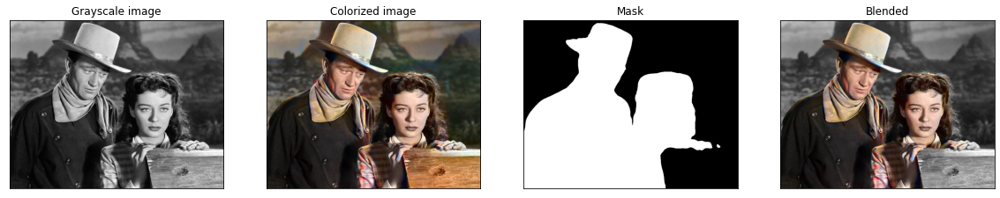
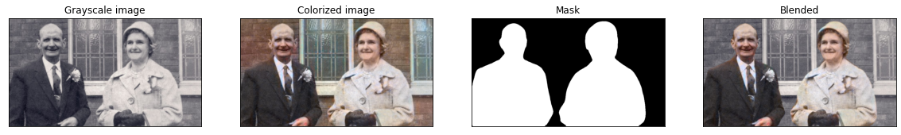
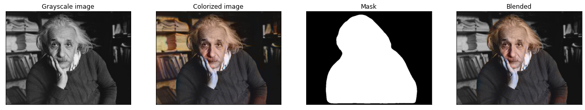
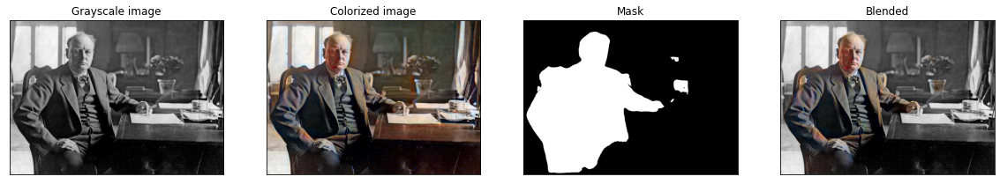
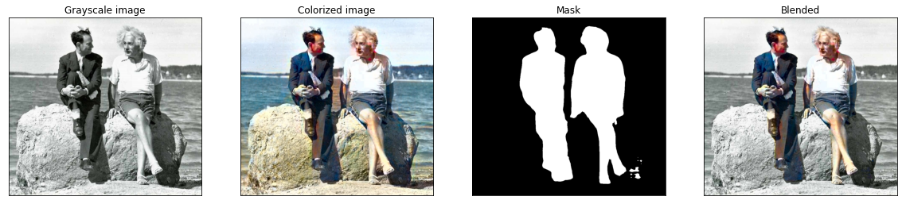

# CS445-Colorization-Project
CS445 Computational Photography Final Project

In this project we implemented a tool to selectively and automatically colorize the foreground of black and white photographs.  The tool consists of two main algorithms.  First, ViT-LSGAN a visual transformer based LS-GAN  colorizes the entire photograph.  Second, a DeepLabv3 segmentation network segments the foreground from the background.  Lastly, the colorized foreground is blended with the original background to produce a distinctive image.

See [our final report](Project.pdf) for details.

